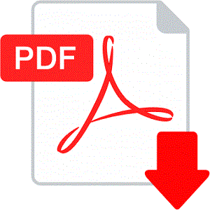
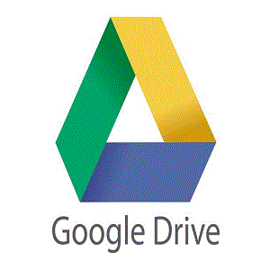

## RECURSOS COMPARTIDOS
---

| | |  |  |
|---|---|---|---|

* [libros en PDF](recursos/libros.md)
    - Detalle: 0 Libros
* [Cursos en Google Drive](recursos/cursos.md)
    - Detalle: 9 Libros   
* [Cursos en Mega](recursos/mega.md)
    - Detalle: 0 Cursos en Mega
* [Cursos en uTorrent](recursos/utorrent.md)
    - Detalle: 0 Cursos en uTorrent

---
:pencil2: [Edit this page on GitHub](https://github.com/jasp402/BibliotecaJS/edit/master/docs/recursos/index.md)
